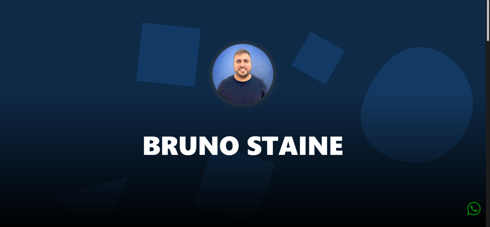

<h1 align="center"> Portifolio</h1>

  

## Descrição do projeto

- É um projeto pessoal do meu portifólio, a ideia desse projeto é que eu possa atualizar sempre com novos projetos que estaram em produção. Também quero mostrar para as pessoas um pouco do meu trabalho. Nesse projeto de portifólio você pode clicar em um projeto que está publicado e ver um pouco do projeto. Tem vários projetos porém não posso deixar todos publicos aqui então aos poucos vou inserindo alguns projetos que julgo interessantes para o portifólio.

## Funcionalidades do projeto

- `Single Page` : Mostra um pouco sobre mim, tem os meus perfis de redes sociais e projetos que você pode dar uma olhada numa simples single page.

## 📁 Acesso ao projeto

**https://brunostaine.netlify.app/**

## Tecnicas e tecnologias utilizadas

* Angular 17
* SCSS
* Scrollreveal
* Prime Icons

- Responsividade
- Designers atuais
- Boas práticas

## Autor

 
Bruno Staine Caires de Oliveira 
https://github.com/Brunostaine 
